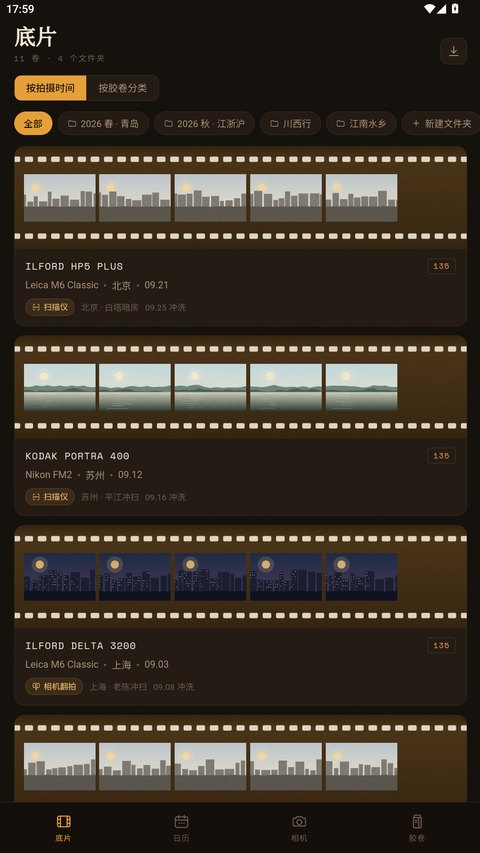
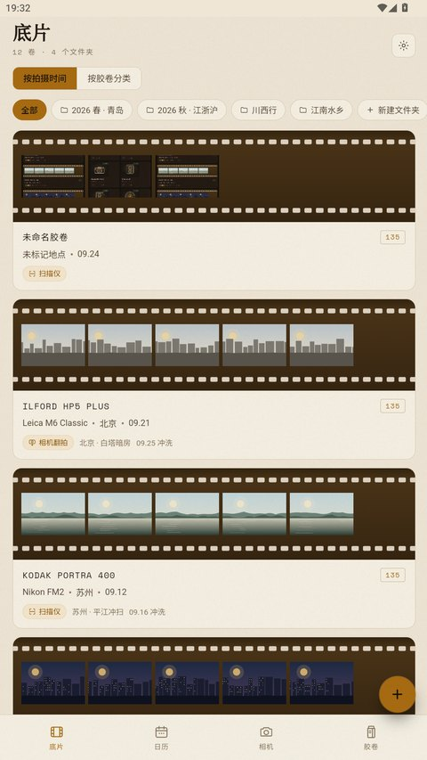
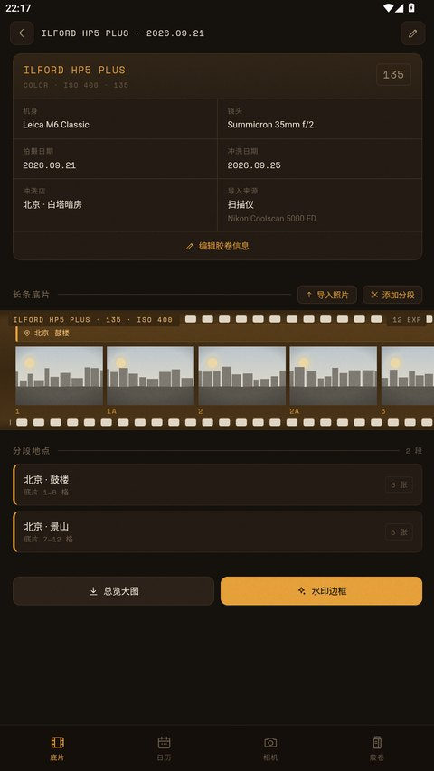
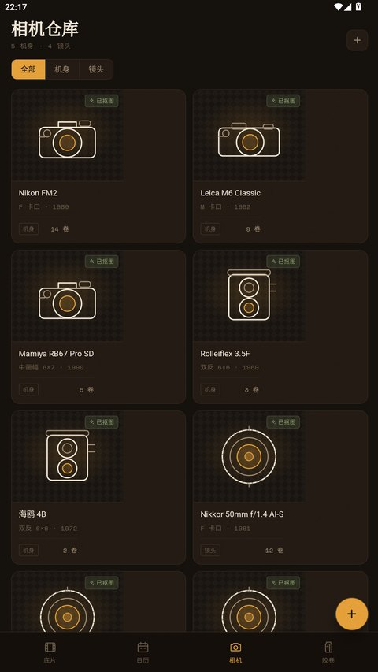
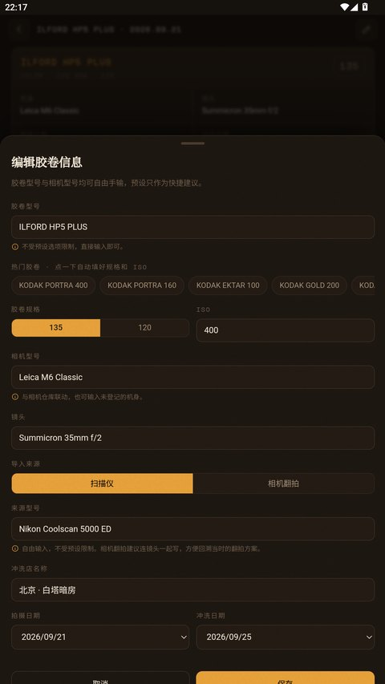
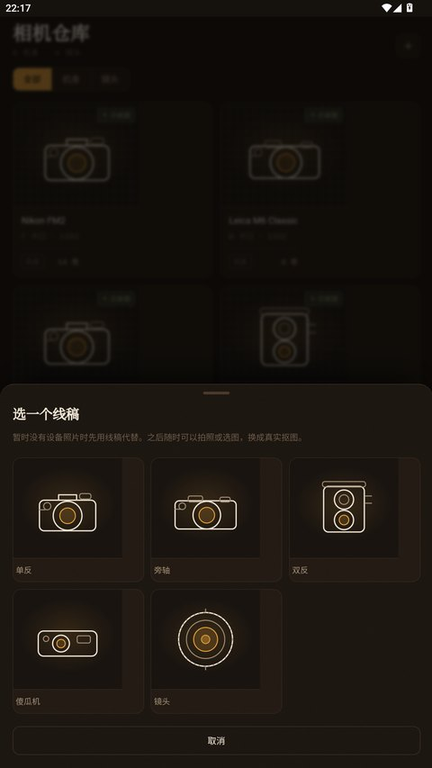

# 菲林档案

给胶片摄影爱好者的**本地归档 App**。把冲洗回来的底片拼成长条，像在观片台上一样一段段看过去，顺手记下它是在哪儿拍的。

纯个人档案工具 —— **没有社交，不做滤镜调色，不联网**。

## 下载

**[⬇ 下载 APK](https://github.com/easonfilming/fliming-box/releases/latest)**（约 4.3 MB）

传到手机上点开安装，允许「安装未知来源应用」。需要 **Android 10 或更高**。

自签名包，没上应用商店，所以系统会提示未知来源 —— 这是正常的。安装包的 SHA-256 和签名指纹在每个 release 的说明里，可以核对。

<p align="center">
  
  
  
</p>
<p align="center">
  
  
  
</p>

---

## 功能

**底片** — 按拍摄时间或按胶卷分类浏览，支持自定义文件夹把多卷归到一起。导入的照片拼接成一整张长条底片，可以横向拖动；长条能切分成多个片段，每段独立标记拍摄地点。片边常驻胶卷型号，每格画面下方是底片编号（`1 / 1A / 2 / 2A…`）。

**摄影日历** — 月历索引胶卷档案，全年柱状图统计每月拍摄量。

**相机仓库** — 登记机身与镜头。两条路径：**从相册选一张**，或者**先挑一个线稿占位**，之后随时换成真图。线稿有单反 / 旁轴 / 双反 / 傻瓜机 / 镜头五种。


**胶卷仓库** — 库存计数，按过期时间由近到远排序，临近过期优先展示。新增时可以从 **29 款热门胶卷预设**里点选，型号、规格、ISO 一次填好；同型号同规格再次入库会累加数量而不是新增一条。

**导出** — 整卷**接触印相（contact sheet）**大图：8 格一行铺开，片头带相机 / 日期 / 冲洗店，每格下方是底片编号，末行不满时是一截短胶片 —— 像冲洗店给的那种印样。也可以给单张照片加胶片风格水印边框（含拍摄地点 / 拍摄时间 / 相机型号）。都直接写进系统相册。

**两套主题** — 暗房（深色底 + 琥珀橙）和米色（接触印相纸的浅色底）。底片本身在两套主题下都是深色，因为那就是底片的颜色。

**首次启动是空白的** —— 没有预置的示例胶卷、器材或库存。这是个记自己东西的工具，一上来塞 11 卷别人的胶卷只会让你先做一轮删除。想看填充后的效果，设置里有「载入示例数据」；想重来一次，设置里有「清空全部数据」。

### 数据字段

导入来源（扫描仪 / 相机翻拍，并可另填具体型号）、冲洗店、胶卷型号、相机型号、冲洗日期、胶卷规格（135 / 120）。**胶卷型号与相机型号都是自由文本，预设只作快捷方式，不受任何白名单限制。**

---

## 技术架构

界面是 **HTML/CSS/JS 跑在 WebView 里**，原生只负责界面碰不到的部分。

```
prototype/film-archive-app.html     ← 全部界面代码的唯一来源
        │  build_assets.py（剥离展示外壳、内嵌字体、注入 app 模式 CSS）
        ▼
app/src/main/assets/index.html      ← 生成物，不要直接改
        │
        ▼
   WebView（https://appassets.androidplatform.net）
        │  @JavascriptInterface
        ▼
   Bridge / DocStore / PhotoStore / Importer / Capture / Exporter
```

为什么这么做：这套设计（长条底片、齿孔、片边代号、分段）本质上是**排版问题**，用 CSS 表达比用原生 View 表达短一个数量级。代价是桥接层要自己写，但换来的是一份代码同时跑在浏览器和手机上 —— `prototype/film-archive-app.html` 直接用 Chrome 打开就是**功能完整**的原型（有持久化、能导入照片、能导出），不是空壳演示。

几个值得一提的设计决定：

- **页面挂在真实 https 源上**（`WebViewAssetLoader`），不是 `file://`。这样照片能用普通 `` 原生加载、WebView 自己缓存，而且 canvas 合成导出时不会被跨源污染（`file://` 加载的图画进 canvas 会 taint，`toDataURL()` 直接抛异常）。
- **自写的 MIME 表**。`androidx.webkit` 自带的 `AssetsPathHandler` 靠 `URLConnection.guessContentTypeFromName` 猜类型，那张表里没有 `.woff2`，会把字体当 `text/plain` 发 —— 而字体加载失败是**静默**的，页面只是"看起来有点不一样"。
- **持久化走原生文件**，`doc.json` 防抖 + 原子写（`tmp` → `fsync` → `rename`），`onPause` 同步 flush。`localStorage` 只作崩溃恢复镜像。
- **清单里没有 `INTERNET` 权限**。这一点是刻意维持的：曾经引入 MediaPipe 时它通过 `tasks-core` → `datatransport` 带进过 `INTERNET` 和一个 AlarmManager 定时上传调度器，后来用 `tools:node="remove"` 摘掉；抠图功能移除后这个依赖整个没有了。

---

## 构建

需要 Windows + PowerShell。工具链是**便携的**，装在项目目录里，不写系统目录、不需要管理员权限。

```powershell
# 1. 装工具链（一次性，约 1.5 GB）
#    JDK 17 + Android SDK (build-tools 34.0.0 / platform 34) + Gradle 8.9 + adb
.\setup_toolchain.ps1

# 2. 构建
.\build_apk.ps1
# 产物：out\filmbox.apk
```

`build_apk.ps1` 会先跑 `build_assets.py`（从原型生成 `index.html`，并拉取 Space Mono 字体），再走 Gradle 打包签名。

签名密钥 `demo.keystore` 缺失时会自动生成一把。**别删** —— 换了钥匙就只能卸载重装，不能覆盖升级。

### 依赖

版本是钉死的，不是随手写的：

- **AGP 8.7.3 + Gradle 8.9** —— 8.7.3 是最后一个只要求 build-tools 34.0.0 的版本。8.13+ 要 35、9.x 要 36，而 `sdkmanager` 没有镜像支持，只能去 `dl.google.com`。
- **`androidx.core` 钉在 1.13.1** —— 1.15+ 要求 compileSdk 35。
- 依赖全部走**阿里云镜像**，构建过程不碰 Google 的网络。

---

## 已知限制

- **minSdk 29**（Android 10）。写相册用的 MediaStore `RELATIVE_PATH` + `IS_PENDING` 从 29 起不需要任何权限；24–28 要 `WRITE_EXTERNAL_STORAGE` 运行时授权，那条路径没有验证过，与其塞一段没测过的权限流程，不如把下限提上来。
- **没有自动抠图**。曾经做过（MediaPipe Interactive Segmenter，端上推理），但效果达不到可用标准 —— 背景稍杂就抠不干净。已移除，改成「从相册选一张」或「用线稿」。移除后 APK 从 25 MB 降到 4.3 MB，也不再限制 ABI。
- 中文界面。没有英文版。

---

## 数据与隐私

所有数据存在 App 私有目录里：

```
<filesDir>/doc.json                        全部元数据
          /photos/<rollId>/<pid>.jpg       展示副本（长边 ≤ 2048）
          /thumbs/<rollId>/<pid>.jpg       缩略图（长边 ≤ 360）
          /originals/<rollId>/<pid>.<ext>  原片（仅导入时勾选"保留原片"）
          /gear/<gearId>.png               设备照片（长边 ≤ 1600）
```

**没有网络请求。** 导出直接写系统相册，照片只存在本机。清单里没有 `INTERNET` 权限 —— 可以用 `adb shell dumpsys package com.filmbox.archive | grep -i permission` 验证。

---

## 目录

```
prototype/film-archive-app.html   界面全部代码（改这里）
build_assets.py                   原型 → app assets 的生成器
build_apk.ps1                     构建入口
setup_toolchain.ps1               工具链安装
app/src/main/java/…/              原生层（桥、存储、导入、导出）
docs/                             README 截图
```
